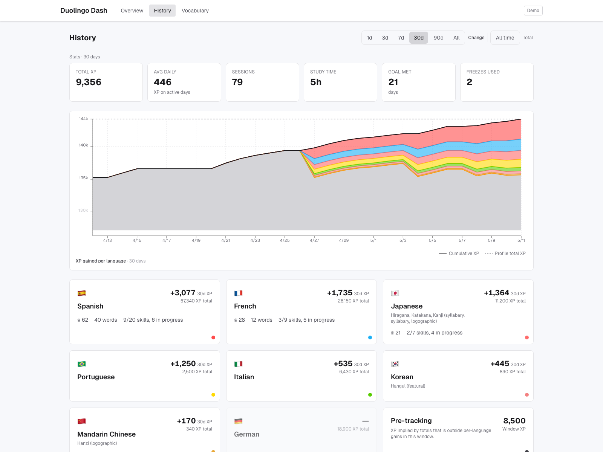
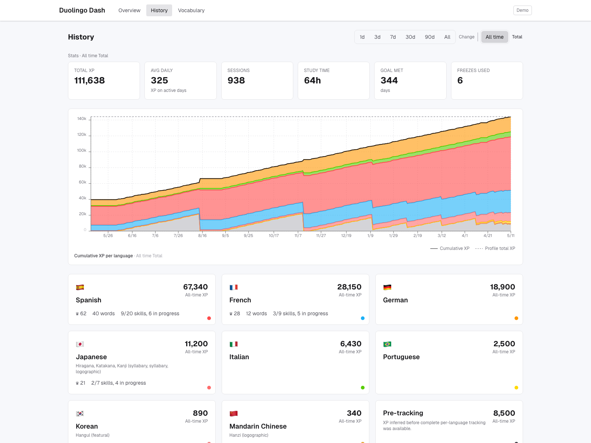
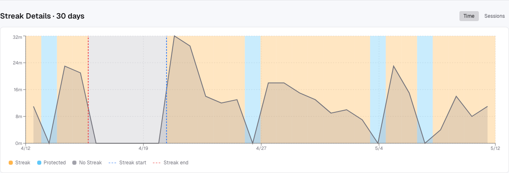

# Duolingo Dash

Personal Duolingo learning dashboard. *Fully vibe-coded*

Track your profile XP, daily streak, and per-course XP (from after you've started syncing course progress). Then go to the course and vocabulary pages for skill and vocabulary insights.

API queries are sent to Duolingo APIs, no third-party services. All data stays local.









## Setup

```bash
npm install
```

### Regenerate README screenshots (demo)

One command re-seeds `data/mock.db`, starts a demo-only `next dev` on **port 3001** with a separate **`.next-demo/`** build cache (so it does not touch `data/duolingo.db` or your normal `.next/` on port 3000), writes the PNGs under `docs/screenshots/` (including three History shots: change / total / streak), then stops the server:

```bash
npx playwright install chromium   # once per machine
npm run screenshots
```

### Get your JWT

1. Log into [duolingo.com](https://www.duolingo.com) in your browser
2. Open Developer Tools (F12)
3. Go to **Application > Cookies > duolingo.com**
4. Copy the value of `jwt_token`
5. Pass this to the application through the DUOLINGO_JWT environment variable.

Alternatively, in the **Network** tab, find any request to duolingo.com and copy the `Authorization` header value after `Bearer`.

### Run the dashboard

```bash
read -s DUOLINGO_JWT && export DUOLINGO_JWT
npm run dev
```

Open [http://localhost:3000](http://localhost:3000).

The JWT lives in the server process memory only. It is never written to disk.

Next.js dev mode only trusts `localhost` by default. This app also allows
`127.0.0.1`; for any other dev hostname, set `NEXT_ALLOWED_DEV_ORIGINS` to a
comma- or space-separated list of hostnames before starting `npm run dev`.

## What it does while running

The dashboard's goal is simple: stay current without interrupting you while you practice. An all-course cycle sync temporarily switches your active Duolingo course, so it's designed to only run when you're not actively earning XP.

**Background sync, at a glance:**

- **Every 30 min** — cheap XP check only, no course switching.
- **If your XP changed** — switches to a 2-min account watch. Any XP or active-course change in that window resets the quiet counter (you're still practicing, or something else is using the account). 10 minutes of quiet plus a short random backoff → one full all-course sync.
- **Every night at a configurable hour (default 23:00, in your resolved timezone)** — one full all-course sync to catch idle-day changes. The hour is selectable from the polling-status panel and remembered across restarts. The timezone follows the resolver chain: SyncBar **Override** input (in the same panel) → `DUOLINGO_TZ` env → Duolingo profile → host. Nightly uses the same quiet watcher, so if you happen to be earning XP or switching courses around that hour, it waits until the account is quiet.
- **Manual Refresh** — resyncs the active course only.
- **Manual Sync All Languages** — resyncs every course immediately (same disruption caveat below).

### Heads-up: all-course syncs switch your active Duolingo language

Reading skill and vocab data requires Duolingo's API to have that course active on your account. During a full all-course sync, Dash temporarily switches your active course one-at-a-time and switches back when done. This is visible in the real Duolingo app — if you start a lesson mid-sync you might land in the wrong language. The quiet window before Dash fires one is specifically designed to avoid this. If the active course changes unexpectedly during an automatic all-course sync, Dash aborts the cycle, skips drift-tainted course-detail writes, and waits for a quiet window before retrying.

### Pause + progress bar

Click the polling indicator in the header to open a small panel:

- **Pause** stops all background sync (baseline 30-min XP checks, the 2-min quiet watcher, and the nightly). Manual **Refresh** and **Sync All Languages** still work while paused. Pause resets on server restart — if you want it permanently off, pause again after each restart.
- While a sync is running, the panel shows an approximate progress bar. It's based on the median of your recent sync durations, so the first few syncs (before any history) show an indeterminate bar.

### Running a display-only second instance (read-only mode)

To preview the UI on a second machine (or a remote server) without contending with your local writer for the Duolingo API, point a second process at the same SQLite file with `DUOLINGO_READ_ONLY=1`:

```bash
DUOLINGO_READ_ONLY=1 npm run dev
```

In this mode the process:

- opens `data/duolingo.db` with `readonly: true` (writes throw at the SQLite layer),
- skips the `DUOLINGO_JWT` requirement, the polling timers, and the nightly sync,
- returns `503 { "error": "read-only" }` from `POST /api/sync`, `POST /api/sync-course`, and `POST /api/polling`,
- displays a **Read-only** badge in the header and hides the Refresh / Sync All buttons.

Charts and history pages render exactly as on the writer instance. The DB file should be on shared storage or copied from the writer; SQLite WAL is concurrent-read-safe with one writer.

### Instance roles and sync locking

Most installs should run exactly one normal server. That default role is
`writer`: it serves the dashboard, runs the 30-minute XP checks, runs the
quiet watcher, and runs the nightly sync. Multiple browsers or devices can
open the same writer safely; sync mutations are single-flight inside that
server process.

If you run extra processes, choose the role deliberately:

| Role | Env | Use when |
| --- | --- | --- |
| `writer` | default, or `DUOLINGO_INSTANCE_ROLE=writer` | This is the one normal syncing server. Background polling and nightly sync are enabled. |
| `manual` | `DUOLINGO_INSTANCE_ROLE=manual` | A second test instance with its own DB that should allow manual syncs but should not run background polling or nightly timers. |
| `read-only` | `DUOLINGO_INSTANCE_ROLE=read-only` or `DUOLINGO_READ_ONLY=1` | A display-only instance. No JWT client, no polling, no sync writes. |

The shared cross-process resource is your Duolingo account's active course.
If more than one process can sync with the same account, configure the same
Redis/Valkey account lock on every mutating process:

```bash
DUOLINGO_SYNC_LOCK_REDIS_URL=redis://localhost:6379
# Optional, useful when sharing one Redis across unrelated accounts/deploys:
DUOLINGO_SYNC_LOCK_NAMESPACE=my-duolingo-account
```

When the external lock is configured, sync mutations acquire the local
single-flight gate first, then the Redis/Valkey lock. If the external lock is
busy or unavailable, Dash skips/fails the sync instead of risking overlapping
course switches.

The lock serializes sync mutations; it does not merge SQLite databases or make
background timers cluster-aware. Prefer one `writer` plus `manual` or
`read-only` extras. Multiple background writers on the same Duolingo account
are still discouraged.

## Testing

```bash
npm test
```

Runs the full Jest suite. No extra setup needed. See `**TESTING.md**` for how to run subsets and `**docs/testing.md**` for coverage and the test backlog.

## Where to look


| Doc                               | For                                                                                |
| --------------------------------- | ---------------------------------------------------------------------------------- |
| `**TESTING.md**`                  | Running the test suite                                                             |
| `**docs/architecture.md**`        | How polling, sync, pause, and the internal API routes fit together                 |
| `**docs/api-map.md**`             | Duolingo endpoints, `language_data` keys, `xp_daily` aggregates, known limitations |
| `**docs/testing.md**`             | Test design, coverage, backlog                                                     |
| `**docs/roadmap.md**`             | Planned features                                                                   |
| `**CLAUDE.md**` / `**AGENTS.md**` | Agent-oriented notes                                                               |


## Architecture at a glance

- **Next.js** (App Router) — pages and server-side API routes.
- **SQLite** (better-sqlite3) — historical snapshots in `data/duolingo.db`.
- **Recharts** — XP and progress charts.
- **Tailwind CSS** — styling.

```
Browser (localhost:3000) → Next.js API routes → duolingo.com
                                  ↕
                            SQLite (data/duolingo.db)
```

Details: `**docs/architecture.md**`.
