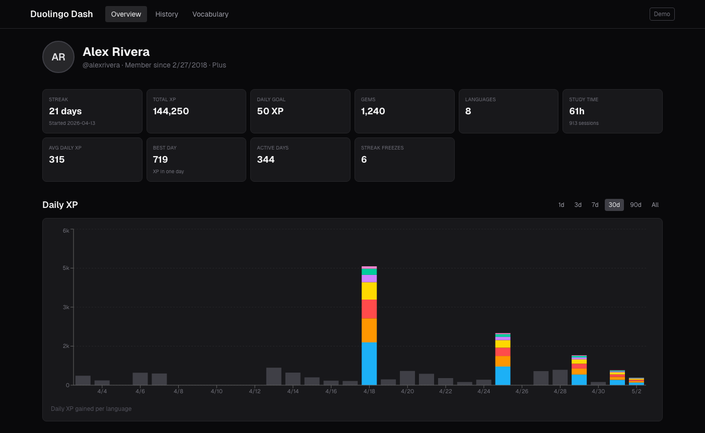
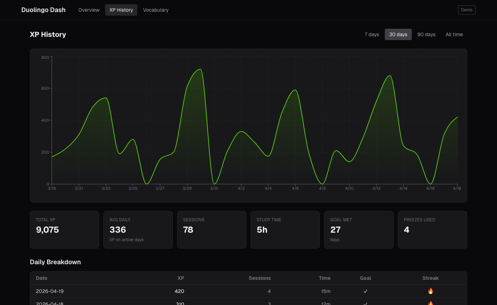
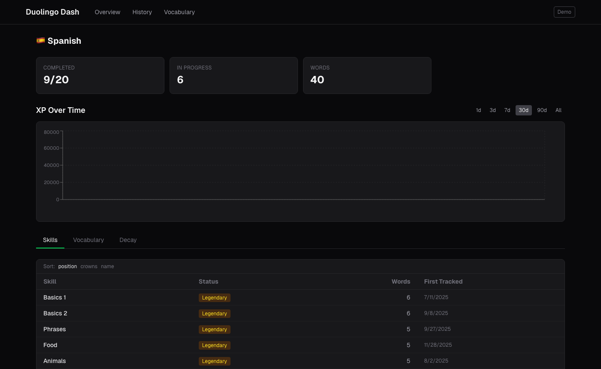
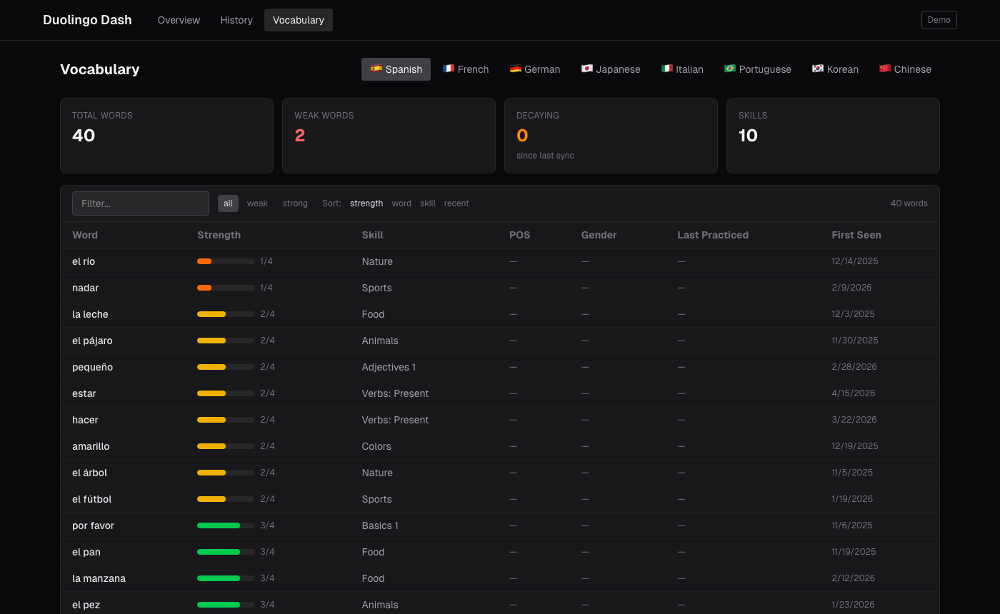

# Duolingo Dash

Personal Duolingo learning dashboard. All data stays local — API calls go directly to duolingo.com, no third-party services.



<details>
<summary>More screenshots</summary>







</details>

## Setup

```bash
npm install
```

### Get your JWT

1. Log into [duolingo.com](https://www.duolingo.com) in your browser
2. Open Developer Tools (F12)
3. Go to **Application > Cookies > duolingo.com**
4. Copy the value of `jwt_token`

Alternatively, in the **Network** tab, find any request to duolingo.com and copy the `Authorization` header value after `Bearer` .

### Run the dashboard

```bash
read -s DUOLINGO_JWT && export DUOLINGO_JWT
npm run dev
```

Open [http://localhost:3000](http://localhost:3000).

## Testing

```bash
# Run all tests
npm test

# Run tests in watch mode
npx jest --watch

# Run a specific test file
npx jest scripts
npx jest duolingo
npx jest db

# Run with coverage report
npx jest --coverage
```

### Test structure

Tests are in `src/lib/__tests__/`:


| File                         | Covers                                                                                                        |
| ---------------------------- | ------------------------------------------------------------------------------------------------------------- |
| `duolingo.test.ts`           | JWT parsing, API error handling (401/429/non-JSON), legacy endpoint URL construction (username vs numeric ID) |
| `db.test.ts`                 | Schema constraints, NOT NULL enforcement, upsert behavior, first_seen preservation, snapshot accumulation     |
| `queries.test.ts`            | Decay detection (vocab + skills), XP stats aggregation (including freeze rows), course comparison joins, vocab-from-skills fallback |
| `sync.test.ts`               | Null-safe XP summary mapping, null date filtering, avatar URL protocol handling                               |
| `legacy-language-data.test.ts` | Resolving legacy `language_data` keys (`nb`/`no`, `zh`/`zs`, inner `language`, single-key fallback)          |
| `scripts.test.ts`        | Writing system classification, script skill identification, Latin/non-Latin detection, skill categorization   |
| `language-names.test.ts` | Language name and flag emoji lookup, unknown language fallbacks                                               |
| `polling.test.ts`        | Refresh cooldown enforcement, XP change detection, first-sync trigger                                         |


### What the tests verify

Alongside the table above, tests cover:

- JWT `sub` claim edge cases (null, string, number)
- Dead endpoints returning HTML instead of JSON (must not parse as JSON)
- Null / missing fields on XP summaries before they hit SQLite `NOT NULL` columns
- Snapshot-based decay (compare latest vs previous snapshot per skill/vocab)
- Protocol-relative avatar URLs (`//…` → `https://…`)
- Legacy **`language_data`** key resolution (e.g. `nb`/`no`, `zh`/`zs`) and **`XP_STATS_SQL`** aggregates (freeze rows vs practice-day counts)

## Architecture

- **Next.js** (App Router) — pages and server-side API routes
- **SQLite** (better-sqlite3) — historical snapshots in `data/duolingo.db`
- **Recharts** — XP and progress charts
- **Tailwind CSS** — styling

### Data flow

```
Browser (localhost:3000) → Next.js API routes (localhost) → duolingo.com
                                    ↕
                              SQLite (data/duolingo.db)
```

JWT lives in server process memory only. Never written to disk.

**`docs/api-map.md`** — Duolingo endpoints ↔ this app (sync flow, legacy `language_data` keys, `xp_daily` / `XP_STATS_SQL` aggregates). **`CLAUDE.md`** — agent-oriented build/architecture notes and API caveats for contributors.

### Polling

- Every 15 minutes: lightweight XP check — if XP changed, triggers a full all-course sync (temporarily switches your active Duolingo language per course)
- Every 3 hours: full all-course sync regardless of XP change (catches skill updates on idle days)
- Manual **Refresh** button: full sync of active course only
- **Sync All Languages** button: immediate full all-course sync (temporarily switches your active language on Duolingo — use when not actively learning)

### Known API limitations

- The Duolingo API is **unofficial** — reverse-engineered from web traffic, no stability guarantees
- The **`2017-06-30`** versioned URL prefix has been stable for years, but individual endpoints can still disappear without notice
- `/vocabulary/overview` is dead since ~2024 (returns HTML). Vocab is extracted from skill word lists as a fallback — no reliable per-word POS, gender, or last-practiced from that path
- Detailed skill/vocab data follows the **active** Duolingo course unless you run **Sync All Languages** (which switches your active language on Duolingo temporarily)
- Legacy **`GET /users/{username}`** uses **username**, not numeric user ID. **`language_data`** top-level keys may not match **`courses[].learningLanguage`** — see **`docs/api-map.md`** §⑤ and **`src/lib/legacy-language-data.ts`**. In development, **`GET /api/debug`** exposes **`legacyLanguageResolution`** per course
- Avatar URLs from the profile API are often protocol-relative or need a size suffix (**`/xlarge`**) to load publicly; bare avatar URLs frequently **403**
- Rate limiting is CAPTCHA-style (**403** + `blockScript`), not classic HTTP **429**. The ~15-minute poll interval matches common community practice
